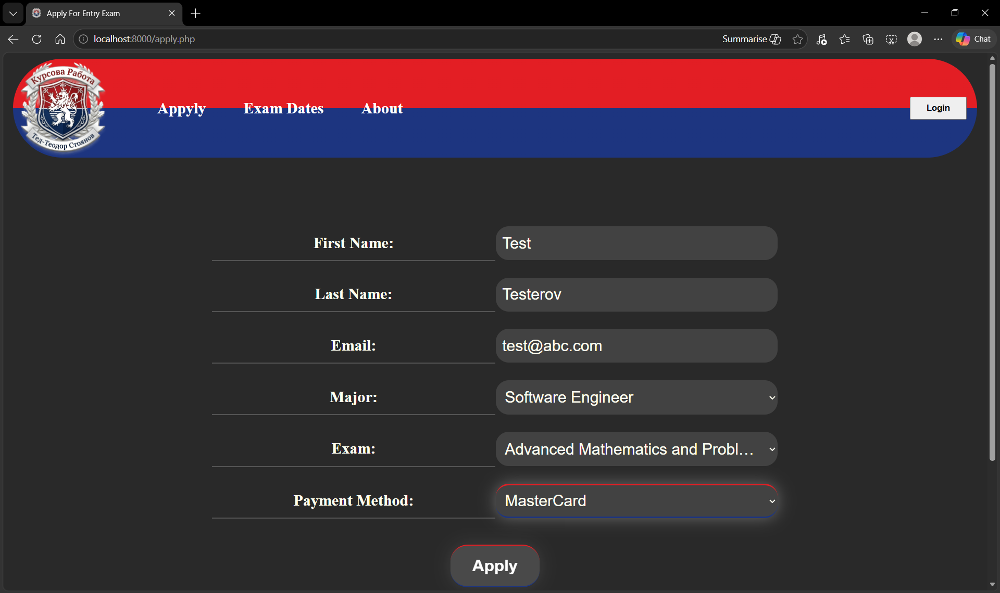
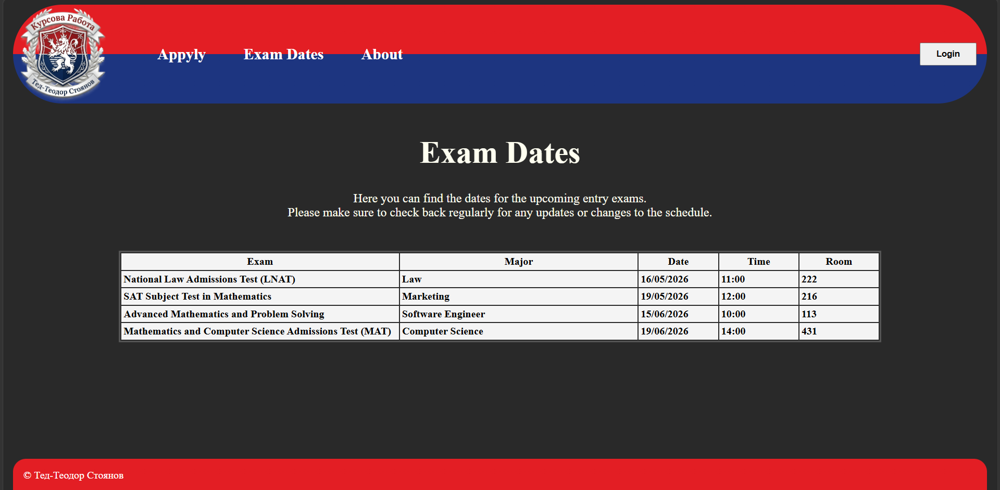
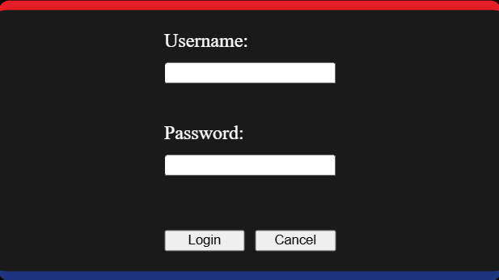

# Entry-Exam
(Still Work in Progress)

A website for applying to college entrance exams, build with HTML, CSS, JavaScript, PHP and XAMPP.

## Index Page

## Apply Page

## Exam Dates Page

## Login Window

## About this project
This project was developed as part of a University Assignment.

Using XAMPP, several SQL tables were created to store data about applicants, exams, majors, and users (administrators). The website connects to the database through PHP, allowing dynamic interaction with the stored data.

Through this connection, the system supports full database operations, including adding new applicants, updating existing records, and deleting data. This ensures efficient management of the application process.

